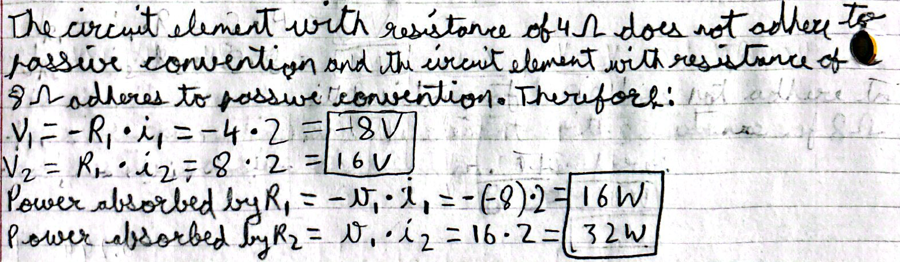

The circuit element with resistance of 4Ω does not adhere to passive convention and the circuit element with resistance of 8Ω adheres to passive convention. Therefore:
$$V_1 = -R_1 \cdot i_1 = -4 \cdot 2 = -8V$$
$$V_2 = R_2 \cdot i_2 = 8 \cdot 2 = 16V$$
Power absorbed by $R_1 = -v_1 \cdot i_1 = -(-8) \cdot 2 = 16W$
Power absorbed by $R_2 = v_2 \cdot i_2 = 16 \cdot 2 = 32W$