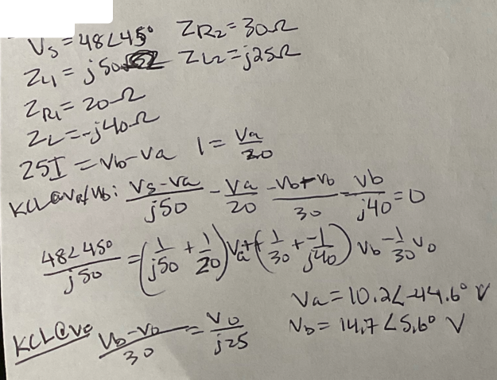

$V_s = 48\angle45^\circ$
$Z_{R2} = 30\Omega$
$Z_{L1} = j50\Omega$
$Z_{L2} = j25\Omega$
$Z_{R1} = 20\Omega$
$Z_L = -j40\Omega$

$25I = V_b - V_a$
$I = \frac{V_a}{30}$

**KCL @ Va/Vb:**
$$
\frac{V_s - V_a}{j50} - \frac{V_a}{20} - \frac{V_b + V_o}{30} - \frac{V_b}{j40} = 0
$$
$$
\frac{48\angle45^\circ}{j50} = \left(\frac{1}{j50} + \frac{1}{20}\right)V_a + \left(\frac{1}{30} + \frac{-1}{j40}\right)V_b - \frac{1}{30}V_o
$$

**KCL @ Vo**
$$
\frac{V_b - V_o}{30} = \frac{V_o}{j25}
$$

$V_a = 10.2\angle-44.6^\circ V$
$V_b = 14.7\angle5.6^\circ V$