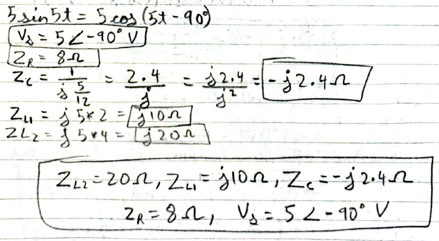

$5 \sin 5t = 5 \cos(5t - 90^\circ)$
$$V_s = 5 \angle -90^\circ V$$
$$Z_R = 8 \Omega$$
$$Z_c = \frac{1}{j \frac{5}{12}} = \frac{2.4}{j} = \frac{j 2.4}{j^2} = -j 2.4 \Omega$$
$$Z_{L1} = j 5 * 2 = j 10 \Omega$$
$$Z_{L2} = j 5 * 4 = j 20 \Omega$$

$Z_{L2} = 20 \Omega, Z_{L1} = j 10 \Omega, Z_c = -j 2.4 \Omega$
$Z_R = 8 \Omega, V_s = 5 \angle -90^\circ V$