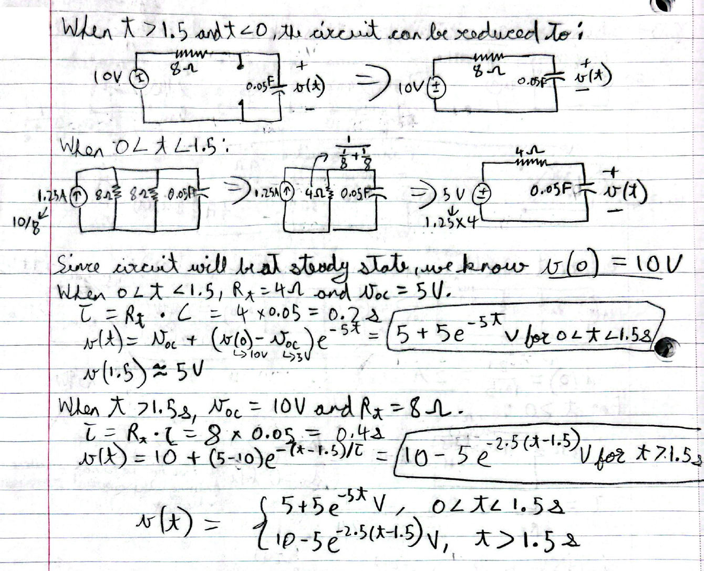

When $t > 1.5$ and $t < 0$, the circuit can be reduced to:
> [A circuit diagram shows a 10V voltage source in series with an 8Ω resistor and a 0.05F capacitor. The voltage across the capacitor is labeled v(t) with the positive terminal on top.] => [The circuit is simplified for DC steady state, showing the 10V voltage source in series with the 8Ω resistor and an open circuit where the capacitor was. The voltage across the open circuit is labeled v(t).]

When $0 < t < 1.5$:
> [A circuit diagram shows a 1.25A current source (with a side note "10/8") in parallel with two 8Ω resistors and a 0.05F capacitor.] => [The two 8Ω resistors are combined in parallel (indicated by an arrow and the calculation `1/(1/8 + 1/8)`) into a single 4Ω resistor. The circuit now consists of the 1.25A current source in parallel with the 4Ω resistor and the 0.05F capacitor.] => [A source transformation is performed on the current source and parallel resistor. The resulting circuit has a 5V voltage source (with a side note "1.25x4") in series with a 4Ω resistor and the 0.05F capacitor. The voltage across the capacitor is labeled v(t).]

Since circuit will be at steady state, we know $v(0) = 10V$
When $0 < t < 1.5$, $R_t = 4\Omega$ and $V_{oc} = 5V$.
$\tau = R_t \cdot C = 4 \times 0.05 = 0.2s$
$v(t) = V_{oc} + (v(0) - V_{oc})e^{-t/\tau} = 5 + (10 - 5)e^{-5t} = 5+5e^{-5t}$ V for $0 < t < 1.5s$
$v(1.5) \approx 5V$

When $t > 1.5s$, $V_{oc} = 10V$ and $R_t = 8\Omega$.
$\tau = R_t \cdot C = 8 \times 0.05 = 0.4s$
$v(t) = 10 + (5-10)e^{-(t-1.5)/\tau} = 10 - 5e^{-2.5(t-1.5)}$ V for $t > 1.5s$

$$ v(t) = \begin{cases} 5+5e^{-5t} \text{V}, & 0 < t < 1.5s \\ 10-5e^{-2.5(t-1.5)} \text{V}, & t > 1.5s \end{cases} $$