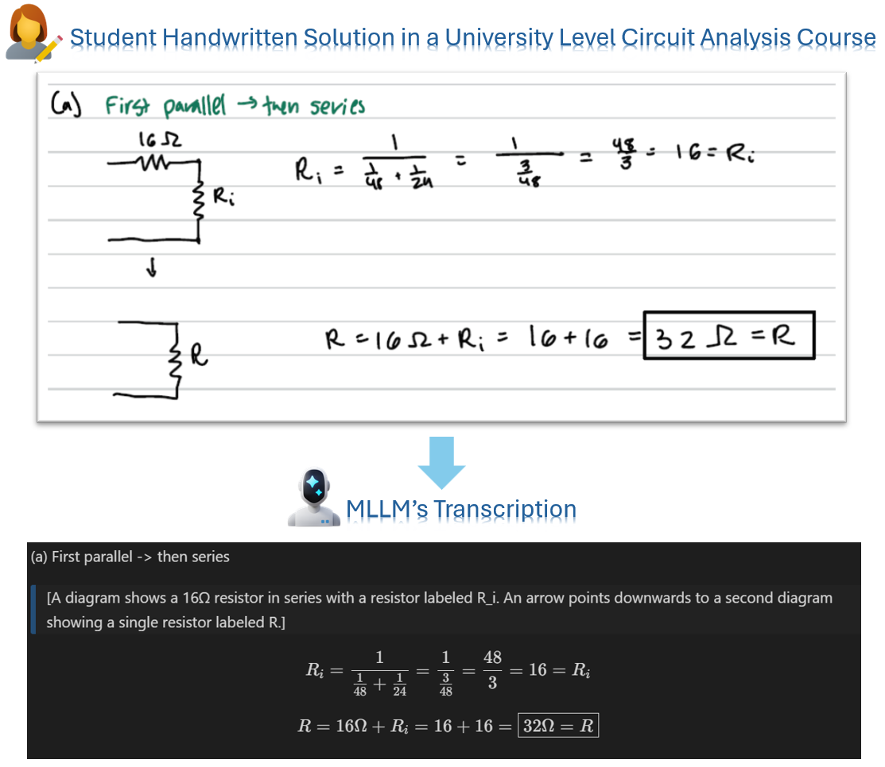
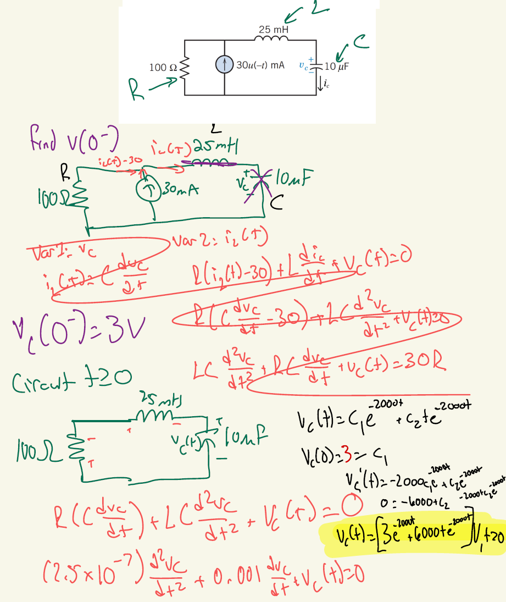
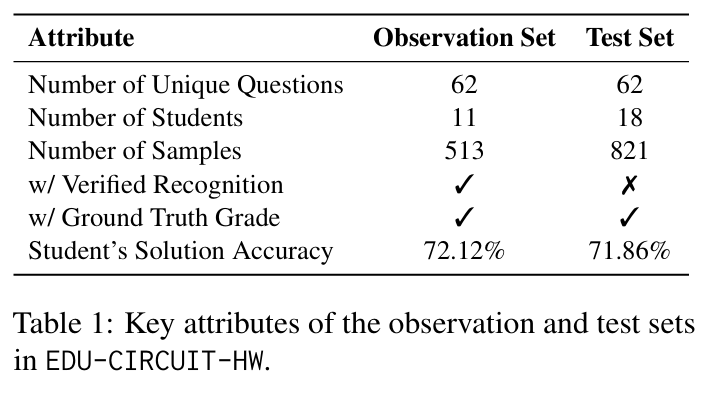

# EDU-CIRCUIT-HW

This is the official repository for the paper "Evaluating Multimodal Large Language Models on Real-World University-Level STEM Student Handwritten Solutions" (ACL findings 2026).

---

## Quick Start

## I. Data Structure

The brief illustration of our data is shown as belowing Figure: (1) the original student handwritten resolutions for a specific question and (2) the expert verified full-text transcript of it. Our paper aim to analyze the impact of potential recognition errors for (1) and its downstream influence to the auto-grading task. Finally, we adopte a human-in-the-loop pipeline to make the grading system rebust with minimal human intervention (for only 2-4% of all assignments).

<p align="center">
  
</p>

#### 1. Student Handwritten Works

Our anonymized student handwritten work photos/screenshots within a undergraduate level circuit analysis course at a large, public, research-intensive institution (Gatech, Atlanta, Course ECE 2040) in the Southeast United States during the Spring 2025 semester. To be specific, the structure of the directory is as follows for each involved samples (with unique *Homework ID*, *Student Id*, and *Question ID*):
```
Screenshot_output_anon/{Homework_ID}/{Student_ID}/{Question_ID}.png
```
An example (Student 42 Question 9.5-1 at Homework 7) of this png is shown as below:

<p align="center">

</p>

**Examples:**
- Student 2's solution for Homework 1, Question 1.5-2:  
  ```
  Screenshot_output_anon/Homework1/student_2/1.5-2.png
  ```
- Multiple images per question (ordered by index):
  ```
  Screenshot_output_anon/Homework1/student_2/3.6-1_(1).png
  Screenshot_output_anon/Homework1/student_2/3.6-1_(2).png
  ```
---

#### 2. Dataset Split

<p align="center">

</p>

As shown above, in our paper, the Observation/test split metadata is stored in:

```
Screenshot_output_anon/set_splitting/
```

Each CSV file (e.g., `obsetf_involved_data.csv`) lists the Homework ID, Student ID, and Question ID for the corresponding subset.

---

#### 3. Grading Reports & Rubrics

| Resource | Location |
|----------|----------|
| Reports for Observation set | `obset.xlsx` |
| Reports for Test set | `valset.csv` |
| Rubrics | `Screenshot_output_anon/rubric_outputs/` |

> **Note:** Problem statements are not included due to copyright (Svoboda & Dorf, *Introduction to Electric Circuits*, 9th Ed., Wiley 2013). Readers interested in our work can use the question indices (e.g., P1.5-2, P3.6-1) to look them up in the textbook.

---

#### 4. Expert-Rectified Recognition Results

This serves as the ground truth for the recognition results in the observation set, which you can find in the directory:

```
Rectified_recognized_markdown_done_Anon/Final_4_LLM_judge/
```

**Example path:**
```
Rectified_recognized_markdown_done_Anon/Final_4_LLM_judge/Homework_collected_database_trial_Homework1_student_41/models/gemini-2.5-pro/Compare/1.5-2_markdown.md
```

Each markdown contains expert-corrected recognition outputs (via Gemini 2.5 Pro) for the observation set for a specific question (e.g., Student 41's question 1.5-2 in Homework1).
Note: If you can find one question covered in the observation set (i.e., find the Homework ID, Student ID, Question ID in "Screenshot_output_anon/set_splitting/obsetf_involved_data.csv") while you cannot find it in this directory, it means the expert did not rectify the recognition results for this question!

---

## II. Run the Handwritten Recognition Pipeline

### 1. Configuration

- **Default model:** Gemini 2.5 Pro
- **API key:** Set `GEMINI_API_KEY` in the `.env` file
- **System prompt:** `handwritting_recognition_utils/Prompts/Initial_prompt_wo_problem_statement_v6.txt`

You can customize your own MLLM model and prompt by editting `handwritting_recognition_utils/MLLM_ocr_utils/gemini_inference_utils.py` (see `get_gemini_response`, called by `batch_wise_handwritting_image_ocr_processing.py` to visually recognize student handwritten images).

### 2. Run the Pipeline

```bash
cd handwritting_recognition_utils
python batch_wise_handwritting_image_ocr_processing.py \
  --task_name "Your_Task_Name" \
  --API_model_name "Your_MLLM_Model_Name" \
  --split_name "observation"  # or: test, debug, currently we recommend you to use observation only.
```

**Example:**
```bash
python batch_wise_handwritting_image_ocr_processing.py --task_name Test --API_model_name models/gemini-2.5-pro --split_name observation
```

**Output location:**
```
Outputs/{Your_Task_Name}/Homework_collected_database_trial_Homework{id1}_student_{id2}/models/{Your_MLLM_Model_Name}/Compare/{id3}_markdown.md
```

Where `{id1}`, `{id2}`, `{id3}` are Homework ID, Student ID, and Question ID.

---

## III. Automatic Recognition Correctness Evaluation

Recognition outputs are evaluated against the ground truth (introduced in Section I.4) using Gemini 2.5 Pro as judge. To be specific, you can use the following command to run the recognition error detecting and analyzing pipeline.

### Steps

```bash
cd check_recognition_error_val

# 1. Run LLM-as-judge
python step_9_run_LLM_as_a_judge_on_data_debug_full_data.py --task_name "Your_Task_Name" --model_name "Your_MLLM_Model_Name"

# 2. Exclude strict items from OCR error analysis
python step_10_exclude_strict_items_in_OCR_err.py --task_name "Your_Task_Name" --model_name "Your_MLLM_Model_Name"

# 3. View recognition error statistics (from which you can get Sample Error Rate (SER) and Average Error Count (AEC) as shown in Table 5 in our paper of your MLLM visual recognition pipeline!)
python step_11_show_LLM_as_a_judge_result.py --task_name "Your_Task_Name" --model_name "Your_MLLM_Model_Name"

# 4. Generate recognition error taxonomy
python step_12_recognition_error_taxonomy.py --task_name "Your_Task_Name" --model_name "Your_MLLM_Model_Name"

# 5. Visualize the taxonomy (results like Figure 4 in our paper.)
python step_13_visualize_taxonomy.py --task_name "Your_Task_Name" --model_name "Your_MLLM_Model_Name"
```

**Example:**
Here we provide an example to use *models/gemini-2.5-pro* for the Automatic Recognition Correctness Evaluation. If you have run the following command to use *models/gemini-2.5-pro* model to recognize students' handwritten works in the observation set:

```bash
cd handwritting_recognition_utils
python batch_wise_handwritting_image_ocr_processing.py --task_name Test --API_model_name models/gemini-2.5-pro --split_name observation
```

And then corresponding command example for running recognition error detecting and analyzing pipeline:

```bash
cd check_recognition_error_val
python step_9_run_LLM_as_a_judge_on_data_debug_full_data.py --task_name Test --model_name models/gemini-2.5-pro
python step_10_exclude_strict_items_in_OCR_err.py --task_name Test --model_name models/gemini-2.5-pro
python step_11_show_LLM_as_a_judge_result.py --task_name Test --model_name models/gemini-2.5-pro
python step_12_recognition_error_taxonomy.py --task_name Test --model_name models/gemini-2.5-pro
python step_13_visualize_taxonomy.py --task_name Test --model_name models/gemini-2.5-pro
```

---

## Citation

If you use this dataset or code, please cite our paper on EDU-CIRCUIT-HW.

```
@article{sun2026circuit,
  title={EDU-CIRCUIT-HW: Evaluating Multimodal Large Language Models on Real-World University-Level STEM Student Handwritten Solutions},
  author={Sun, Weiyu and Chen, Liangliang and Cai, Yongnuo and Xie, Huiru and Zeng, Yi and Zhang, Ying},
  journal={arXiv preprint arXiv:2602.00095},
  year={2026}
}
```