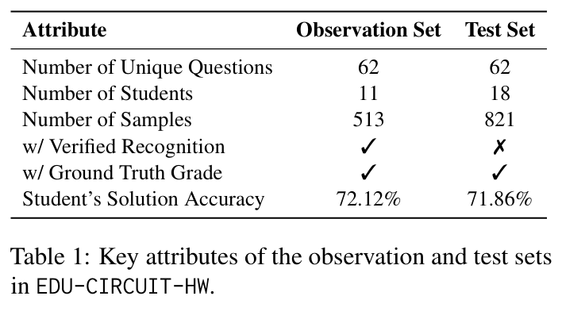
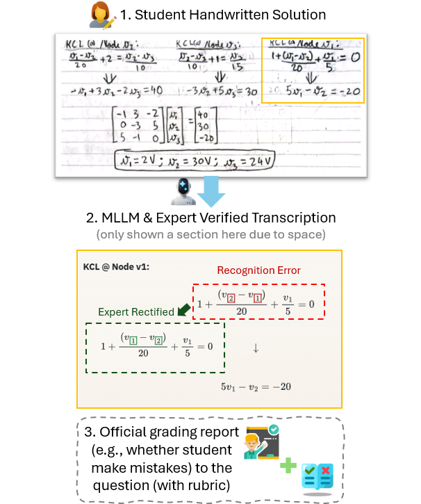

# THE EDU-CIRCUIT-HW DATASET

EDU-CIRCUIT-HW is an anonymized dataset for studying multimodal handwritten recognition and downstream grading on authentic university-level STEM coursework. The release contains student handwritten circuit-analysis solutions collected from the Spring 2025 offering of an entry-level circuit-analysis course at the Georgia Institute of Technology, together with model-generated transcripts, grading metadata, rubric files, split metadata, and expert-rectified reference transcripts for a subset of samples with identified recognition errors.

This dataset is officially associated with the ACL 2026 Findings paper, *"EDU-CIRCUIT-HW: Evaluating Multimodal Large Language Models on Real-World University-Level STEM Student Handwritten Solutions"* ([Project Website](https://gt-learning-innovation.github.io/CIRCUIT_EDU_HW_ACL)). For implementation details, evaluation pipelines, and usage guidelines, please visit our [official GitHub repository](https://github.com/gt-learning-innovation/CIRCUIT_EDU_HW_ACL).

## Dataset Snapshot

The EDU-CIRCUIT-HW dataset includes an observation set used for recognition-error analysis and a test set used for evaluation. The split summary below highlights the released dataset attributes reported in the paper (Table 1), including question coverage, student counts, sample counts, and the availability of verified recognition references and ground-truth grading labels.

<p align="center">
  
</p>

<p align="center"><em>Figure 1: Key attributes of the observation and test sets in EDU-CIRCUIT-HW.</em></p>

## Dataset Content Overview

The following example illustrates how one instance in our data connects three parts of the release: (1) a student handwritten solution image, (2) an MLLM(Gemini-2.5-Pro)-recognized transcript together with the expert-verified correction, and (3) the official grading report associated with the same question attempt. 

Note: This example is included here only as a schematic overview, and the full data package stores these assets in the directory structure documented below.

<p align="center">
  
</p>

<p align="center"><em>Figure 2: An example dataset sample linking handwritten student work, model recognition with expert verification, and official grading metadata.</em></p>

## Directory Overview

The package is organized in four top-level directories:

### `Screenshot_output_anon/`

- Original anonymized student handwritten solution images in `.png` format
- Split metadata in `.csv` format
- Grading reports in `.xlsx` / `.csv`
- Rubric definitions in `.json`
- Auxiliary manual annotation / working files used during dataset preparation

Organization:

```text
Screenshot_output_anon/
|-- Homework1/
|   |-- student_2/
|   |   |-- 1.5-2.png
|   |   |-- 1.5-3.png
|   |   |-- 3.6-1_(1).png
|   |   `-- 3.6-1_(2).png
|   `-- ...
|-- manually_checked_TA_label/
|-- rubric_outputs/
|-- set_splitting/
`-- Manual_drawn_recognition_error_onenote_Anon/
```

Important files:

- `set_splitting/obsetf_involved_data.csv`: observation-set split metadata
- `set_splitting/test_involved_data.csv`: test-set split metadata
- `manually_checked_TA_label/obset.xlsx`: observation-set grading report
- `manually_checked_TA_label/valset1.csv`: test-set evaluation grading report
- `rubric_outputs/P*.json`: question-level rubric definitions
- `Manual_drawn_recognition_error_onenote_Anon/Anon_Handwritten_for_2040_Part_1 2.one`: some visual illustrations on the MLLM's (Gemini-2.5-Pro) recognition errors (note: these annotatated recognition errors may not reflect all potential recognition errors in these samples, instead, this document just provides some vivid error distribution examples)

### `Observationset_Final/`

Model-recognized transcripts for the observation subset, with paired source-image copies used by each model pipeline.

Top-level model folders observed in the release:

- `v6_claude_sonnet4p5`
- `v6_Gemini_2p5`
- `v6_Gemini_3`
- `v6_gpt5p1`
- `v6_qwen3vl8bthinking`
- `v6_qwen3vlplus`
- `v6_qwen3vlplus_backup`

Representative per-sample layout:

```text
Observationset_Final/
`-- v6_Gemini_2p5/
    `-- Homework_collected_database_trial_Homework1_student_2/
        `-- models/
            `-- gemini-2.5-pro/
                `-- Compare/
                    |-- 1_5-2_markdown.md
                    |-- 1_5-2_source.png
                    |-- 3_6-1_1_markdown.md
                    `-- 3_6-1_1_source.png
```

Notes:

- File names use underscores in place of dots within question IDs, for example `1_5-2_markdown.md` corresponds to question `P1.5-2`.
- Multi-page student solutions may appear as indexed files such as `3_6-1_1` and `3_6-1_2`.

### `Valset/`

Model-recognized transcripts for the held-out evaluation subset, organized in the same per-sample structure as `Observationset_Final/`.

Top-level model folders observed in the release:

- `v6_Gemini_2p5`
- `v6_Gemini_3`
- `v6_gpt5p1`

Representative per-sample layout:

```text
Valset/
`-- v6_Gemini_2p5/
    `-- Homework_collected_database_trial_Homework1_student_10/
        `-- models/
            `-- gemini-2.5-pro/
                `-- Compare/
                    |-- 1_5-2_markdown.md
                    |-- 1_5-2_source.png
                    |-- 3_6-1_markdown.md
                    `-- 3_6-1_source.png
```

### `Rectified_recognized_markdown_done_Anon/`

Expert-rectified Gemini-2.5-Pro transcripts for a subset of observation-set samples, with paired source images for the corrected samples.

Representative layout:

```text
Rectified_recognized_markdown_done_Anon/
`-- Final_4_LLM_judge/
    `-- Homework_collected_database_trial_Homework1_student_21/
        `-- models/
            `-- gemini-2.5-pro/
                `-- Compare/
                    |-- 1_5-2_markdown.md
                    |-- 1_5-2_source.png
                    |-- 3_2-6_markdown.md
                    `-- 3_2-6_source.png
```

Notes: **This directory is not a full duplicate of the observation set (v6_Gemini_2p5 folder).** Specifically, any sample present in this folder corresponds to a flawed transcription in the original `Observationset_Final/v6_Gemini_2p5` directory, providing the manually corrected version instead. In contrast, if the initial Gemini-2.5-Pro's transcription in `Observationset_Final/v6_Gemini_2p5` is correct, then this sample will not be included in this directory!

## File Naming Notes

- Homework folders follow `Homework1`, `Homework2`, etc.
- Some examples in the `Screenshot_output_anon` folder are not included in the observation set and test set, such as all samples in `Homework 3` due to their extremely complexity, we may keep working on this in future!
- Student folders use anonymized unique IDs such as `student_2` and `student_31`. These IDs are unique identifiers only and should not be interpreted as a contiguous sequence from 1 to the total number of students.
- Question IDs in image folders generally use dots and parentheses, for example `3.6-1_(1).png`. While question IDs in recognized transcript folders use underscores, for example `3_6-1_1_markdown.md`.
- Each question ID in our dataset precisely corresponds to the question with the same Question ID in the textbook [1]. Due to copyright issues, we didn't include the original question statement in this package.

[1] James A Svoboda and Richard C Dorf. 2013. Introduction to Electric Circuits (9th Edition). John Wiley & Sons.


## Citation

If you use this dataset or code, please cite our paper on EDU-CIRCUIT-HW.

```
@article{sun2026circuit,
  title={EDU-CIRCUIT-HW: Evaluating Multimodal Large Language Models on Real-World University-Level STEM Student Handwritten Solutions},
  author={Sun, Weiyu and Chen, Liangliang and Cai, Yongnuo and Xie, Huiru and Zeng, Yi and Zhang, Ying},
  journal={arXiv preprint arXiv:2602.00095},
  year={2026}
}
```